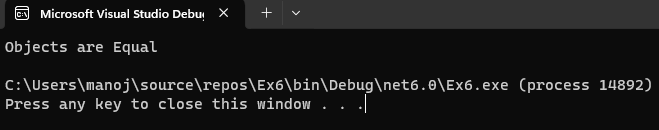

# Operator-Overloading

## Aim:
 To write a C# program to pass values through constructors(default and parameterized) and also overload equal operators by checking whether objects are equal using operator overloading. 
 
 ## Algorithm:
### Step 1:
Create a class operator

### Step 2:
Pass values through the constructor

### Step 3:
Return the bool operator, (==) and (!=)

### Step 4:
Create a object to store the return object

### Step 5:
Print the program.
 
 ## Program:

 ```
 Developed by: Manoj Kumar S
Register number: 212221230056

 ```
 ```c#
 using System;
namespace overloading
{
    class program
    {
        public int l;
        public program()
        {
            l = 20;
        }
        public program(int i)
        {
            l = i;
        }
        public static bool operator ==(program p1, program p2)
        {
            return p1.Equals(p2);
        }
        public static bool operator !=(program p1, program p2)
        {
            return !p1.Equals(p2);
        }
        public static void Main(string[] args)
        {
            program e1 = new program();
            program e2 = new program(20);
            e1 = e2;
            if (e1 == e2)
            {
                Console.WriteLine("Objects are Equal");
            }
            else
            {
                Console.WriteLine("Objects are not Equal");
            }
        }
    }
}
 ```
 
## Output:
    
 
## Result:
Thus the C# program to check whether objects are equal using operator overloading is implemented successfully.